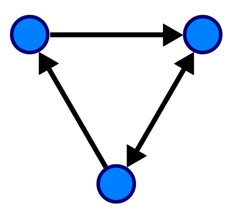
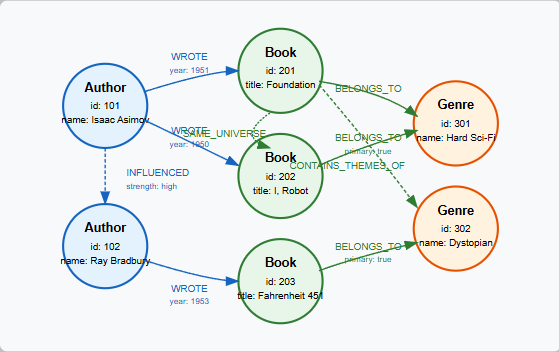

Introduction to Graphql
=====================

In this section, we will learn about GraphQL. We will learn about what it is, how it works,
and how it can be used to manage data in an API. Throughout this module, students should
be able to:

* Describe the Graph Data Structure.
* Describe what is GraphQL.
* Understand how GraphQL works.
* Understand the difference between REST and GraphQL APIs.

What is a Graph?
----------------------

Definition
::
    A graph is a data structure with nodes and edges that shows relationships
    between objects.

The circles in the picture are nodes and the lines are the edges.
Some notes about nodes and edges in graphs:

Graphs are used to show complex relationships in a succinct mantter.
Some properties of graphs are the following:

1. Edges can be directed or undirected.
2. Edges can have weights.
3. Edges can have labels.
4. Nodes can have types.
5. Nodes can have labels.

Let's take a look a graph data structure representing the relationship between two authors,
Isaac Asimov and Ray Bradbury, and the books they wrote.

Some other types of graphs are the following.

1. Directed Graphs. Sometimes graphs can only move in one direction.
::
    C -> A -> R
2. Cyclic Graphs. Graphs that have cycles. A cycle is a path that starts and ends at the same node.
::
    A -> B -> C -> A
3. Weighted Graphs. Graphs that have weights on their edges.
::
    A -> B (5)

Graphs are commonly used in our every day lives. Some examples are:
    - Maps that are used for navigation. Apple Maps or Google Maps.
        - These are graphs with weights representing both distance and time to find the shortest path from point A to point B.
    - Social Networks. Facebook, X, Instagram.
        - They link our friends to other friends via graphs.
    - Recommendation Systems.
        - Spotify creates graphs between the music we like to determine new suggestions for us.
    - AI and Machine Learning.
        - Graphs are used to represent complex relationships between data points.
          Such as given input `X, Y, Z`, calculate output `W`?

What is GraphQL?
----------------------

From the GraphQL website: https://graphql.org/

.. code-block:: RST

    GraphQL is a query language for APIs and a runtime for fulfilling those
    queries with your existing data. GraphQL provides a complete and understandable
    description of the data in your API, gives clients the power to ask for
    exactly what they need and nothing more, makes it easier to evolve APIs over time,
    and enables powerful developer tools.

Much better definition:
::

    GraphQL is a query language that allows you to query exactly what you need
    from your service while using the Graph concept.

Examples
----------------------

Say that we have a SQL database that stores information related to books.
We have tables for books, authors, publishers, and awards. We have a REST API and a GraphQL
API that we can use to query this data. Let's see how we can use both APIs to get the same
data and how we can use GraphQL to get exactly what we need.

Get all Information
~~~~~~~~

REST
^^^^^^^^^

Request
"""""""""
* Multiple Steps
    * ``https://library.com/books (Get all books and their information)``
    * ``https://library.com/books/{id}/authors (Get Authors of a book by ID)``

* Single Step
    * ``https://library.com/books?include=authors (Get all books and their authors)``

Response
"""""""""
.. code-block:: JSON

    {
        "books": [
            {
                "title": "The Sparrow",
                "authors": [
                    {
                        "name": "Mary Doria Russell"
                    }
                ],
                "publisher": "Villard",
                "year": 1996
                "awards": [
                    {
                        "name": "Arthur C Clarke Aware",
                        "year": 1996,
                        "category": "Science Fiction"
                        "awarder": "British Science Fiction Association"
                    },
                    {
                        "name": "Pulitzer Prize",
                        "year": 2020,
                        "category": "Fiction"
                        "awarder": "Columbia University"
                ]
            },
            {
                "title": "Foundation",
                "authors": [
                    {
                        "name": "Isaac Isamov"
                    }
                ],
                "publisher": "Astounding Science Fiction",
                "year": 1951
                "awards": [
                    {
                        "name": "Hugo Award",
                        "year": 1966,
                        "category": "Best All-Time Series"
                        "awarder": "World Science Fiction Society"
                    }
                ]
            }
        ]
    }

GraphQL
^^^^^^^^

Request
"""""""""

::

    query {
        books {
            title
            authors {
                name
            }
            publisher
            year
            awards {
                name
                year
                category
                awarder
            }
        }
    }

Response
"""""""""
.. code-block:: JSON

    {
        "data": {
            "books": [
                {
                    "title": "The Sparrow",
                    "authors": [
                        {
                            "name": "Mary Doria Russell"
                        }
                    ],
                    "publisher": "Villard",
                    "year": 1996
                    "awards": [
                        {
                            "name": "Arthur C Clarke Aware",
                            "year": 1996,
                            "category": "Science Fiction"
                            "awarder": "British Science Fiction Association"
                        },
                        {
                            "name": "Pulitzer Prize",
                            "year": 2020,
                            "category": "Fiction"
                            "awarder": "Columbia University"
                    ]
                },
                {
                    "title": "Foundation",
                    "authors": [
                        {
                            "name": "Isaac Isamov"
                        }
                    ],
                    "publisher": "Astounding Science Fiction",
                    "year": 1951
                    "awards": [
                        {
                            "name": "Hugo Award",
                            "year": 1966,
                            "category": "Best All-Time Series"
                            "awarder": "World Science Fiction Society"
                        }
                    ]
                }
            ]
        }
    }

Both of these examples returned all the book information including a list of its
awards and authors. Now let's look at an example where we want to retrieve only a subset of the data.

Get only book titles and award names for the books
~~~~~~~~

REST
^^^^^^^^^

Request
"""""""""
``https://library.com/books (Get all books with titles)``

Response
"""""""""
.. code-block:: JSON

    {
        "books": [
            {
                "title": "The Sparrow",
                "publisher": "Villard",
                "year": 1996
                "awards": [
                    {
                        "name": "Arthur C Clarke Aware",
                        "year": 1996,
                        "category": "Science Fiction"
                        "awarder": "British Science Fiction Association"
                    },
                    {
                        "name": "Pulitzer Prize",
                        "year": 2020,
                        "category": "Fiction"
                        "awarder": "Columbia University"
                ]
            },
            {
                "title": "Foundation",
                "publisher": "Astounding Science Fiction",
                "year": 1951
                "awards": [
                    {
                        "name": "Hugo Award",
                        "year": 1966,
                        "category": "Best All-Time Series"
                        "awarder": "World Science Fiction Society"
                    }
                ]
            }
        ]
    }

GraphQL
^^^^^^^^^

Request
"""""""""

::

    query {
        books {
            title
            awards {
                name
            }
        }
    }

Response
"""""""""
.. code-block:: JSON

    {
        "data": {
            "books": [
                {
                    "title": "The Sparrow",
                    "awards": [
                        {
                            "name": "Arthur C Clarke Aware"
                        },
                        {
                            "name": "Pulitzer Prize"
                        }
                    ]
                },
                {
                    "title": "Foundation",
                    "awards": [
                        {
                            "name": "Hugo Award"
                        }
                    ]
                }
            ]
        }
    }

We see that with GraphQL we get exactly what we need in the second request compared to the REST API
which might omit the authors information, but still include all the extra awards, publisher, and year information
that we don't need. This is the power of GraphQL.

We could potentially add filters to the REST API to get exactly what we need, but that would require
extra work on the server side to implement those filters. With GraphQL, we get that feature built-in.

.. caution::

    GraphQL is **NOT** a replacement for REST APIs. It is another tool in the toolbox that can be used
    to manage data in an API. It is up to the developer to decide which API is best for their service.

Creating a GraphQL API
----------------------

The foundation of any GraphQL API is its schema. A schema is a formal description of your API's types, relationships, and capabilities. It serves as a contract between the client and the server.

What is a GraphQL Schema?
~~~~~~~~

A GraphQL schema defines:

- The types of data available
- The relationships between these types
- The operations clients can perform (queries, mutations, subscriptions)
- Input types for arguments

Creating Types in GraphQL
~~~~~~~~

GraphQL's type system helps you define the shape of your data. Here are the core scalar types:

- `Int`: A signed 32-bit integer
- `Float`: A signed double-precision floating-point value
- `String`: A UTF-8 character sequence
- `Boolean`: `true` or `false`
- `ID`: A unique identifier, serialized as a string

Object Types
^^^^^^^^^

Object types represent a kind of object you can fetch from your service, with specific fields:

.. code-block:: graphql

    type Book {
      id: ID!
      title: String!
      author: Author!
      publisher: String
      year: Int
      awards: [Award]
    }

    type Author {
      id: ID!
      name: String!
      books: [Book]
    }

    type Award {
      id: ID!
      name: String!
      year: Int
      category: String
      awarder: String
    }

There are a few call outs to what's happening here:

- The exclamation mark (`!`) indicates that the field is non-nullable.
- You can make a custom Type that includes other custom Types as well. We see that in the Author type.
- You can have lists of types as well. We see that in the Book type with the awards field.

You could even make a list required by adding the exclamation mark after the brackets.
For example: `awards: [Award]!`

Now that we have our types for the objects we want to query, we can define the entry points for reading data and modifying data.

Query Type
^^^^^^^^^

The Query type defines entry points for reading data:

.. code-block:: graphql

    type Query {
      books: [Book]
      book(id: ID!): Book
      authors: [Author]
      author(id: ID!): Author
    }

Everything before the colon is the name of the query and everything after the colon is the return type of the query.
This query type allows clients to:

- Fetch all books
- Fetch a book by ID. The exclamation mark indicates that the ID is a required parameter. We can specify parameters as optional or required as well.
- Fetch all authors
- Fetch an author by ID

Mutation Type
^^^^^^^^^

Mutations are operations that modify data:

.. code-block:: graphql

    type Mutation {
      addBook(title: String!, authorId: ID!, publisher: String, year: Int): Book
      updateBook(id: ID!, title: String, publisher: String, year: Int): Book
      deleteBook(id: ID!): Boolean
    }

This Mutation type allows clients to:

- Add books with optional publisher and year
- Update a book by ID with optional title, publisher, and year
- Delete a book by ID

The mutations all return the type of the object they are modifying. In this case, they all return a Book object.
This is not required but generally a best practice.

What if the parameters grow larger and larger and we want an easy way to pass them in?
This is where Input types come in. They are special object types used for arguments in queries and mutations.

Input Types
^^^^^^^^^

.. code-block:: graphql

    input BookInput {
      title: String!
      authorId: ID!
      publisher: String
      year: Int
    }

    type Mutation {
      addBook(book: BookInput!): Book
      updateBook(id: ID!, book: BookInput!): Book
      deleteBook(id: ID!): Boolean
    }

Here we can see instead of passing each parameter individually to the `addBook` mutation we can pass in a `BookInput` object that contains all the parameters we need to add a book.

Complete Schema Example
^^^^^^^^^

Here's a complete schema for our book library API:

.. code-block:: graphql

    type Book {
      id: ID!
      title: String!
      author: Author!
      publisher: String
      year: Int
      awards: [Award]
    }

    type Author {
      id: ID!
      name: String!
      books: [Book]
    }

    type Award {
      id: ID!
      name: String!
      year: Int
      category: String
      awarder: String
    }

    type Query {
      books: [Book]
      book(id: ID!): Book
      authors: [Author]
      author(id: ID!): Author
    }

    type Mutation {
      addBook(title: String!, authorId: ID!, publisher: String, year: Int): Book
      updateBook(id: ID!, title: String, publisher: String, year: Int): Book
      deleteBook(id: ID!): Boolean

      addAuthor(name: String!): Author
      updateAuthor(id: ID!, name: String!): Author
      deleteAuthor(id: ID!): Boolean
    }

Using this Schema
^^^^^^^^^

With this schema in place, clients can make queries like:

::

    query {
      books {
        title
        author {
          name
        }
      }
    }

Or mutations like:

::

    mutation {
      addBook({
        title: "Dune",
        authorId: "123",
        publisher: "Chilton Books",
        year: 1965
      }) {
        id
        title
      }
    }

The brackets in the `addBook` mutation mean we are passing an InputType object to the mutation.
The schema ensures that clients can only request valid operations and fields, providing built-in validation and clear error messages for invalid requests.

