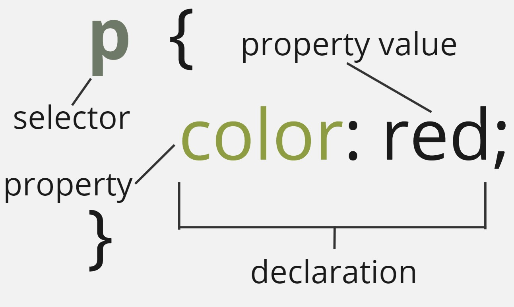
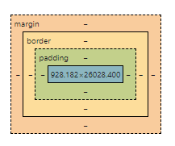

.. role:: red

Introduction to CSS
===========================

In this section, we will explore CSS and how it helps with designing a website.
this includes problems such as coloring (text/background), making the content display at a certain location,
and "decorating" with images and color schemes. After this module, students should be able to:

* Understand the basics of CSS
* Understand how to apply CSS to a webpage
* Understand the different types of CSS selectors
* Understand how to use CSS units
* Understand how to use CSS combinators
* Understand how to use CSS specificity and inheritance
* Understand the CSS box model

Setup and Installation
----------------------

You should still have your old directory from the previous module that covered HTML with the associated **index.html** file.
Navigate to your directory. You can use the ``index.html`` you created last time for Exercise 2 of the HTML, or
copy an update version that is done `here <https://raw.githubusercontent.com/andrewsolis/cs401/refs/heads/main/scripts/web/index_css.html>`_.

Run the following command to setup your small webserver, and navigate to http://localhost:8000/ to verify it is up and running.

.. code-block:: console

    [terminal]$ cd newsite
    [terminal]$ python -m http.server

What is CSS?
------------

CSS, or Cascading Style Sheets, are similar to HTML, in that it is not a programming language.
However, it is also not a markup language. It is rather a **style sheet language**. It is used
to style HTML elements. For example, say we wanted to make all ``p`` tags red.

.. code-block:: css
    :linenos:

    p {
        color: red;
    }

But where exactly do we put this? Notice how you created a folder in the previous material on HTML called ``styles``. 
Open it up and place a new file called **style.css**. Then, paste the following line inside your **index.html** file within
the ``<head>`` tag.

.. code-block:: HTML
    :linenos:

    <link href="styles/style.css" rel="stylesheet" />

All of your paragraph tags should now be red. Be sure to reload the page if needed.

Let's take a closer look at how CSS is used.

Anatomy of CSS
~~~~~~~~~~~~~~

    CSS Anatomy

From the image above we can see a breakdown of a CSS **ruleset**. Let's analyze the individual parts.

- **selector** - The html element type to be styled. 
- **Declaration** - Our single rule is to change the color of the text to red. We have a single declaration here, but there can be multiple for a CSS ruleset.
- **Property** - Which property we like to change or apply to our selector.
- **Property Value** - the value of the property we wish to set.

Instead of just setting the color, let's try setting a few more properties.

.. code-block:: css
    :linenos:

    p {
        color: red;
        background-color:rgb(55, 43, 226);
        height: 100px;
    }

.. note::

    color attributes can be set by many basic colors by name, rgb, hsl, and hex. To learn more about colors click here:  `CSS Colors <https://www.w3schools.com/css/css_colors.asp>`_.

Say instead of just selecting all the ``p`` elements we wanted to select other elements on our page and change their color.

.. code-block:: css
    :linenos:

    p,
    li,
    h3 {
        color: red;
    }

.. warning::

    Try to make sure that certain rules are set for a particular element and not set also in other places. This can create conflicts where you deal with heirarchy of which rules to apply, which
    is normal but can be a pain when starting to learn about CSS.

Types of Selectors
~~~~~~~~~~~~~~~~~~

Up to this point we have only been applying our rulset to HTML elements. However, they are other selectors that are available through CSS that can help make our selections more specific.

Element
^^^^^^^

**Element** selectors select all elements of a given type. We have seen these before when we specified we wanted to apply something to all ``p`` elements.

Example

.. code-block:: css
    :linenos:
    :emphasize-lines: 1,5

    p{
        color: red;
    }

    h1, h2, h3 {
        font-size: 200%
    }

Class
^^^^^

**Class** selector is one of the most common selectors used in CSS. Elements on the page are given a name for the ``class`` attribute of an html element.
Multiple classes can be applied to a single html element, by simply spacing out the class names.
Say we wanted all our titles to have a class, and use a class to change the text color.

.. code-block:: html
    :linenos:
    :emphasize-lines: 2, 7, 10

    <header>
        <h1 class="title gr">Planet Express!</h1>
        ...
    </header>
    ...
    <main>
        <h2 class="title or">Main Content</h2>
        ...
        <aside>
            <h3 class="title bl">Related content</h3>
            ...
        </aside>
    </main>
    <footer>
        
Copyright Planet Express 2024

    </footer>

We then specify a class in our ``style.css`` file using a period (**.**) in the selector place.

.. code-block:: css
    :linenos:

    .title {
        font-style: italic;
    }

    .gr {
        color: green;
    }

    .or {
        color: orange;
    }

    .bl {
        color: blue;
    }

Try changing the color of all of your headlines to different colors using ``classes``.

ID
^^

The ``ID`` selector is used similar to class where it can be applied to an HTML tag using the ``id`` attribute.
However, the similarities stop there, as there are some key differences.

1. The attribute is specified in a css file using the number or hash sign (**#**).
2. An ID is expected to only be placed on a **SINGLE** html element. This is different from classes which can be placed across multiple elements.
3. ID takes a precedence over class, meaning if you define a property in both an ID and Class specification, the ID will be used.

.. code-block:: html
    :linenos:
    :caption: index.html

    <header>
            <h1 id="main_title" class="title gr">Planet Express!</h1>
            
    </header>

.. code-block:: css
    :linenos:
    :caption: style.css

    
    #main_title {
        color: rgb(121, 0, 0);
    }

.. warning::

   Most code editors usually do not detect if an ID is only placed on a single element. 
   This is more of a design pattern that is expected to be followed. 
   With that in mind please be mindful of not accidentally using ID's in multiple places.

Class and id selectors can be combined with element selectors to give even more specificity.

.. code-block:: css
    :linenos:
    :caption: style.css

    h1#main_title {
        font-style: italic;
    }
    
    h2.title {
        color: rgb(121, 0, 0);
    }

Attribute Selectors
^^^^^^^^^^^^^^^^^^^

These selectors are used with element selectors to specify an element based on an attribute that it has. 
This can be used to apply for elements that just have an attribute, or the attribute is set to a specific example.

.. code-block:: css
    :linenos:
    
    /* change all links with href attribute to black */
    a[href] {
        color: black;
    }

Pseudo-class Selector
^^^^^^^^^^^^^^^^^^^^^

These **pseudo-class** selectors are named so because they are styles given to signify a state of an element. 
You can think of different styles that change as you explore a website such hovering over an element, the first line of an element, and more.

.. code-block:: css
    :linenos:
    
    /* link color when hovered over */
    a:hover {
        color: black;
    }

For a full list of all selectors, click here: `CSS Selectors <https://developer.mozilla.org/en-US/docs/Web/CSS/CSS_selectors>`_.

CSS Units
~~~~~~~~~~

You might have noticed that for some styling to size things we used a unit such as ``px``. There are many CSS units that are 
we are unable to cover in this course. If you are interested you can learn more about them here: `CSS Units <https://developer.mozilla.org/en-US/docs/Web/CSS/CSS_Values_and_Units>`_

In general there are a few that are worth mentioning that you will most commonly see and use.

.. table:: 
    :widths: 30 70

    +----------------+-----------------------------------------------------------+
    | Unit           | Details                                                   |
    +================+===========================================================+
    | ``px``         | Used to represents the size  in terms of "pixels"         |
    +----------------+-----------------------------------------------------------+
    | ``mm``         | milimeters                                                |
    +----------------+-----------------------------------------------------------+
    | ``vh``         | 1% of viewports height. i.e. 1% of iphone screen height   | 
    +----------------+-----------------------------------------------------------+
    | ``vw``         | 1% of viewports width. i.e. 1% of iphone screen width     | 
    +----------------+-----------------------------------------------------------+
    | ``%``          | percentage                                                | 
    +----------------+-----------------------------------------------------------+

Exercise 1
~~~~~~~~~~

Remove all CSS in your current ``style.css`` file.

Apply the follwing styles in your stylesheet file. Be sure to set your attributes as needed in your ``index.html`` file.

- Give each header element (h1 - h6) a different `color <https://www.w3schools.com/cssref/pr_text_color.php>`_ using a **class** selector
- Give each header the **same** `font-family <https://developer.mozilla.org/en-US/docs/Web/CSS/font-family>`_ using a **class** selector
- Set the **font-family** for the footer paragraph with the copyright using an **id** selector
- set the color of all links in the ``nav`` HTML element using **any** selector
- set the color of all links in the ``aside`` only on **hover** using the `hover <https://www.w3schools.com/cssref/sel_hover.php>`_ psuedo selector

Remember that google and even AI are your friend (just not skynet).

Using CSS
---------

Up to now we have only been adding our styles to a stylesheet that we then load in our html file. 
While this is a traditional way of adding styles to a webpage, there are two other ways.
Let's see and compare all three.

External Stylesheet
~~~~~~~~~~~~~~~~~~~

This is the way we have been using, where we reference a stylesheet and load it.

.. code-block:: html
    :linenos:
    :emphasize-lines: 7

    <!doctype html>
    <html lang="en-US">
        <head>
            <meta charset="utf-8" />
            <meta name="viewport" content="width=device-width" />
            <title>Planet Express</title>
            <link href="styles/style.css" rel="stylesheet" />
        </head>
        ...
        </body>
    </html>

This has some useful advantages. We only need to referenced those stylesheets applied on a webpage, and if we wanted to we could
re-use a stylesheet on multiple webpages.

However, this still has some disadvantages. If we are using a css style that is fairly general, (i.e. change all ``p`` tags) we run
the risk of altering other styles in different pages that use the same stylesheet. 

Later on we will explore how to setup some frameworks to minimize this issue.

Internal Stylesheet
~~~~~~~~~~~~~~~~~~~

An **Internal Stylesheet** resides inside the HTML document. A special element, ``
        </head>
        <body>
        ...
        </body>
    </html>

Internal stylesheets are useful where you may not have acces to the external CSS files and only need to make changes on a single page.

However, for sites with multiple web pages it can start to be cumbersome. If you need the same styles for multiple pages, then they
will have to placed inside each respective HTML file.

Inline styles
~~~~~~~~~~~~~

**Inline** styles affect a single HTML element. The ``style`` attribute is modified using semicolon-separated values.

.. code-block:: html
    :linenos:
    :emphasize-lines: 10

    <!doctype html>
    <html lang="en-US">
        <head>
            <meta charset="utf-8" />
            <meta name="viewport" content="width=device-width" />
            <title>Planet Express</title>
        </head>
        <body>
            <header>
                <h1 style="font-size: 15px; font-family:'Courier New';">Planet Express!</h1>
                
            </header>
        ...
        </body>
    </html>

.. warning::

    This type of CSS should used as a last resort. This can quickly make HTML hard to read. It also does not allow a separation
    between code and content. This can also require multiple edits within a single page which can start to increase from a single change.
    I won't say not to use it cause even I still see it used, but definitely try and limit it as much as possible if all other attempts fail.

Combinators
-----------

While considered a selector, combinators are used to select elements based on their relationship to other elements. 
Here we detail some of the most useful combinators.

A full list of combinators can be found here: `CSS Combinators <https://developer.mozilla.org/en-US/docs/Web/CSS/CSS_Selectors>`_.

Descendant Combinator
~~~~~~~~~~~~~~~~~~~~~

| The **descendant combinator** is used to select elements that are descendants of a specified element.  
| This is done by placing a space between the two selectors.  
| Selectors that utilize this combinator are called **descendant selectors**.

.. code-block:: css
    :linenos:

    main p {
        color: red;
    }

This will select all ``p`` elements that are descendants of a ``main`` element.

You can also use this to select elements that are descendants of a class or id.

.. code-block:: css
    :linenos:

    .main p {
        color: red;
    }

This will select all ``p`` elements that are descendants of an element with the class ``title``.

Child Combinator
~~~~~~~~~~~~~~~~

| The **child combinator** is used to select elements that are direct children of a specified element.
| This is done by placing a greater than sign (``>``) between the two selectors.

.. code-block:: css
    :linenos:

    ul > li {
        color: red;
    }

This will select all ``li`` elements that are direct children of a ``ul`` element.

Next-Sibling Combinator
~~~~~~~~~~~~~~~~~~~~~~~

| The **next-sibling combinator** is used to select elements that are the next sibling of a specified element.
| This is done by placing a tilde (``+``) between the two selectors.
| For example, to select all ``p`` elements that are next siblings of a ``div`` element:

.. code-block:: css
    :linenos:

    div + p {
        color: red;
    }

| This will select all ``p`` elements that are next siblings of a ``div`` element.
| A common usecase is to do something with a paragraph that is directly after a header.

.. code-block:: css
    :linenos:

    h2 + p {
        color: red;
    }

| This will select all ``p`` elements that are next siblings of a ``h2`` element.

Subsequent-Sibling Combinator
~~~~~~~~~~~~~~~~~~~~~~~~~~~~~

| The **subsequent-sibling combinator** is used to select elements that are siblings of a specified element.
| This is done by placing a tilde (``~``) between the two selectors.
| This will select all siblings even if they are not directly adjacent to the element.
| For example, to select all ``img`` that come *anywhere* after a ``h1`` element:

.. code-block:: css
    :linenos:

    h1 ~ img {
        border: 1px solid red;
    }

| This will select all ``img`` elements that are siblings of a ``h1`` element.

Complex Selectors
~~~~~~~~~~~~~~~~~

You can use nesting to create rules that use combinaors to create more complex rules.

.. code-block:: css
    :linenos:

    p {
    ~ img {
      }
    }
    /* This is parsed by the browser as */
    p ~ img {
    }

The ``&`` can also be used to create complex selectors.

.. code-block:: css
    :linenos:

    p {
    & img {
      }
    }
    /* This is parsed by the browser as */
    p img {
    }

Combining Selectors
~~~~~~~~~~~~~~~~~~~

You can also combine selectors to create more complex rules.
For example, say you want to select al ``li`` elements with the class ``point`` that are descendants of a ``ul`` element.

.. code-block:: css
    :linenos:

    ul > li[class="point"] {
        color: red;
    }

.. note::

   Be mindful when creating a big list of selectors to select very specific parts. 
   This can make it hard to reuse styles and can make it hard to maintain.
   It is often better to create a simple class or id to apply to the elements you want to style.

Exercise 2
~~~~~~~~~~

Make the following changes to your ``style.css`` file using combinators.

- Select all ``li`` elements that are descendants of a ``ul`` element and ``nav`` element and change their color.
- Select all ``li`` elements that are descendants of a ``ul`` element and ``main`` element and change their color.
- Select all ``p`` elements that are siblings of headers and change their font size.
- Select all ``img`` elements that are siblings of headers and change their border to 7px solid black.

Feel free to add classes and ids to your HTML elements to make it easier to select them with certain combinators. 

Specificity and Inheritance
---------------------------

Specificity
~~~~~~~~~~~

At a certain time when you are styling a page, you will notice that some styles are not being applied as you expect.
This is because of the way CSS handles specificity and inheritance.

Specificity is the way CSS determines which style to apply to an element when there are multiple styles that could apply.
The more specific a style is, the more likely it is to be applied.
The specificity of a style is determined by the number of selectors in the style, and the type of selectors used.
For example, a style with an ID selector is more specific than a style with a class selector, which is more specific than a style with an element selector.
If two styles have the same specificity, the one that comes later in the CSS file will be applied.

.. code-block:: css
    :linenos:

    h1 {
        color: red;
    }

    h1 {
        color: blue;
    }

Say we have two separate selectors: one using an element selector and the other using a class selector.

.. code-block:: css
    :linenos:

    h1 {
        color: red;
    }

    .heading {
        color: blue;
    }

The style with the class selector will be applied, because it is more specific than the style with the element selector.
This is the case even if the ``h1`` selector appears further down in the CSS file.

| The amount of specificity a selector has is measured on a three column value of three categories, or weights: ID, CLASS and TYPE.
| This is usually represented as notation as ``(A, B, C)``
| A number to the left has a higher weight than a number to the right.

For example:

* The selector ``h1`` has a specificity of ``(0,0,1)``, because it has one TYPE selector.
* The selector ``.heading`` has a specificity value ``(0,1,0)`` because it has one CLASS selector.
* The selector ``#main`` has a specificity value of ``(1,0,0)``, because it has one ID selector.
* The selector ``h1.heading`` has a specificity value of ``(0,1,1)``, because it has one TYPE selector and one CLASS selector.
* The selector ``h1#main`` has a specificity value of ``(1,0,1)``, because it has one TYPE selector and one ID selector.
* The selector ``h1.heading#main`` has a specificity value of ``(1,1,1)``, because it has one TYPE selector, one CLASS selector, and one ID selector.

You can learn more about specificity here: https://developer.mozilla.org/en-US/docs/Web/CSS/Specificity.

Inheritance
~~~~~~~~~~~

Inheritance is the way CSS determines which styles are applied to an element based on the styles of its parent elements.
Some CSS property values are inherited from a parent by it's childresn, and some aren't.
For example, the ``color`` property is inherited, so if you set the color of a parent element, the color of its children will be the same.

.. code-block:: css
    :linenos:

    body {
        color: red;
    }

    p {
        color: black;
    }

There are some properties that are not which include width, margin, padding, and border. 

CSS provides five special property values that can be used to control inheritance:

* ``inherit``: The property value is inherited from the parent element.
* ``initial``: The property value is set to the default value for the property.
* ``revert``: The property value is set to the default value for the property, unless the property is naturally inherited, in which case it acts like ``inherit``.
* ``revert-layer``: Resets the property value applied to a selected element to the value extablished in a previous cascade layer.
* ``unset``  : Resets the property to its natural value, which means that if the property is naturally inherited it acts like ``inherit`` and if it is not naturally inherited it acts like ``initial``.

You can learn more about these properties here: https://developer.mozilla.org/en-US/docs/Learn/CSS/Building_blocks/Cascade_and_inheritance.

The Box model
-------------

CSS layouts are mostly based on the box model. The box model is a way of representing elements on a page as boxes with content, padding, borders, and margins.

    CSS Box Model

You can define an elements ``display`` value which specifies how the element is laid out on the page.
Thee most common values are:

* ``block``: The element is displayed as a block, taking up the full width of the page.
* ``inline``: The element is displayed as an inline element, taking up only as much width as it needs.
* ``inline-block``: The element is displayed as an inline element, but can have padding and margins.
* ``flex``: The element is displayed as a flex container, allowing you to use the flexbox layout model.

.. note::

    Flexbox, or the Flexible Box Layout, is a layout model designed to provide a more efficient way to lay out, 
    align, and distribute space among items in a container, even when their size is unknown or dynamic.
    You can learn more about flexbox here: https://css-tricks.com/snippets/css/a-guide-to-flexbox/.

Each box taking up space has the following properties:

* ``Content``: The actual content of the box, such as text or images.
* ``Padding``: The space between the content and the border.
* ``Border``: The border around the box.
* ``Margin``: The space between the border and other elements on the page.

For example, say we have a box with the following CSS:

.. code-block:: css
    :linenos:

    .box {
        width: 250px;
        height: 350px;
        margin: 10px 20px;
        padding: 0px 20px 10px 20px;
        border: 10px solid black;
    }

Then we would have a box that would follow the following properties:

* The content of the box would be **250px** wide and **350px** tall.
* The margin would be **10px** on the top and bottom, and **20px** on the left and right.
* The padding would be **0px** on the top, **20px** on the right, **10px** on the bottom, and **20px** on the left.
* The border would be **10px** wide and **solid black**.

You can learn more about the box model here: https://developer.mozilla.org/en-US/docs/Learn/CSS/Building_blocks/The_box_model.

Exercise 3
~~~~~~~~~~

Make the following changes to your ``style.css`` file to apply different CSS styles.

* Add a border to the ``body`` element with a width of 10px, a style of ``solid``, and a color of ``black``.
* Add a padding to the ``body`` element with **20px** for the top and bottom, and **30px** for the left and right.
* Give your ``body`` and ``html`` elements separate background colors.
* Set the margin for your body tag to ``0 auto``. What does it do?
* Set the margin for your image to be the same as the body tag above and the display to ``block``.

.. note::
    
        The ``0 auto`` margin is a shorthand for setting the top and bottom margins to 0 and the left and right margins to auto.
        This centers the element horizontally on the page by dividing the remaining space equally between the left and right margins.

Why do we set the image display to be ``block``?

.. note::
    Image elements are inline elements by default, which means they will not respect the margin properties.
    By setting the display to block, we can make the image an inline-block element, which will respect the margin properties.

Sass
----

Sass, or Syntactically Awesome Stylesheets, is a preprocessor scripting language that is interpreted or compiled into CSS.
It is a more powerful and flexible way to write CSS, with features such as variables, nesting, and mixins.
You aren't required to learn it now, but it will be worth exploring to understand some of the reasons to use it, especially
if you are interested in website design.
  
You can learn more about Sass here: https://sass-lang.com/guide.

Additional Resources
--------------------
* Some of this materials is based on Mozilla `Learn Web Development <https://developer.mozilla.org/en-US/docs/Learn>`_
* `W3 Schools CSS <https://www.w3schools.com/css/css_intro.asp>`_
* `W3 Schools CSS Units <https://www.w3schools.com/cssref/css_units.php>`_
* `CSS Flexbox Layout Guide <https://css-tricks.com/snippets/css/a-guide-to-flexbox/>`_
* `CSS Guidelines Blog <https://cssguidelin.es/>`_