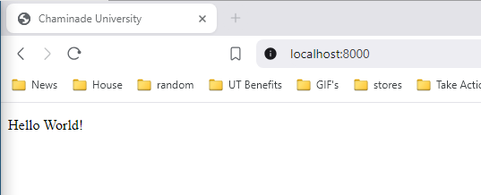
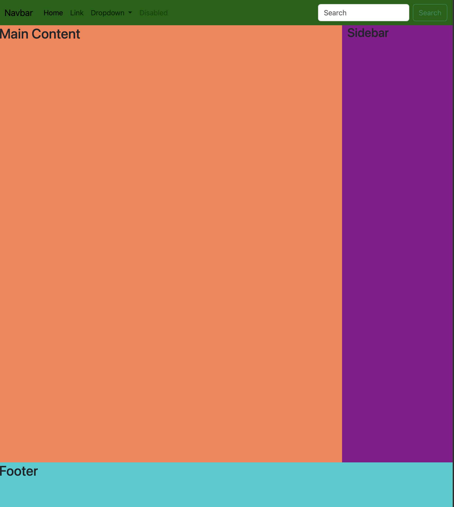
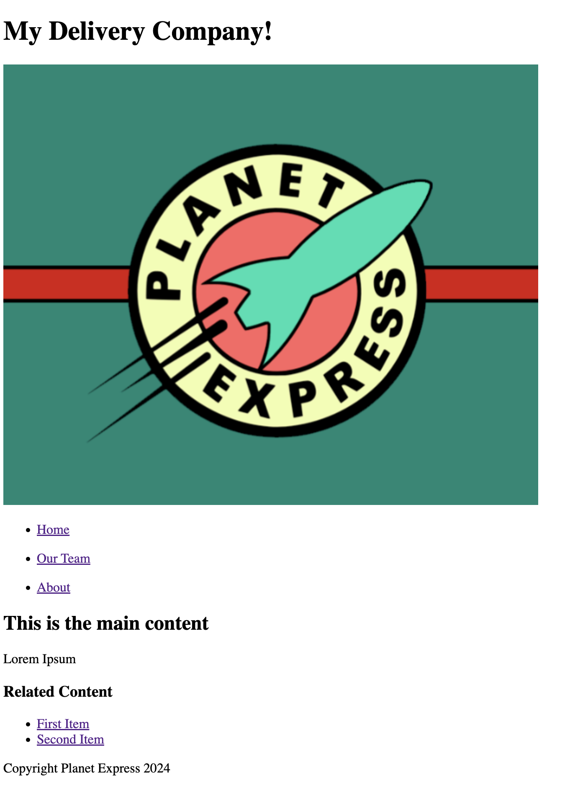

Introduction to HTML
=====================

In this section, we will explore HTML and how it is used to create website.
We will better understand the structure of HTML, certain paradigms to follow, 
and explore ways to personalize and create a website. After going through
this module, students should be able to:

* Describe how HTML works for creating websites.
* Help define a layout of a website.
* understand different features of HTML such as bullets, styling, and using images.

Setup and Installation
----------------------

We will setup a local server so we can view the changes we make. A website is nothing more than
a set of files that are read by and sent to a client to render a website. With this in mind, it
is good to consider the structure of our website. In general a folder structure can be like the
one denoted below:

1. ``sitename`` **folder** - A folder containing all the source code for a web application.
2. ``index.html`` - Genreally contains the homepage content, including text and images. Contained within the ``sitename`` folder.
3. ``images`` **folder** - Folder containing any images that will be rendered on the website. Contained within the ``sitename`` folder.
4. ``styles`` **folder** - Folder containing *CSS* code to style our website. Contained within the ``sitename`` folder.
5. ``scripts`` **folder** - Contains *Javascript* code for our website. Contained within the ``sitename`` folder.

Create a folder named ``newsite``. Then within that folder create the three previously mentioned folders. Also copy the ``index.html`` from 
the git repo `here <https://raw.githubusercontent.com/andrewsolis/cs401/refs/heads/main/scripts/web/index.html>`_ and place it into the folder.
Once completed your stucture should look similar to the one shown below:

.. code-block:: console

    [terminal]$ cd newsite
    [terminal]$ ls
    images index.html scripts styles

It's okay to not understand what these folders do just yet. The following explanations will give you a better understanding of what goes into 
each of these folders/files.

Python3 comes with a with a module for creating a simple `HTTP server <https://docs.python.org/3/library/http.server.html>`_. This allows you the ability
to create a simple webserver for a specific directory. This is particularly useful if you want to test more than just the layout of your site, but also
load javascript files and run those within the website. To create a simple http server for our project, navigate to the directory and then run
the following command: 

.. code-block:: console

    [terminal]$ cd newsite
    [terminal]$ python -m http.server

Once your server is up and running, navigate to http://localhost:8000/ to view your website. You should see a blank page with the text ``Hello world!``




    Hello World Webpage

.. note::

   The command for python2 is a little different: ``python -m SimpleHTTPServer`` 

Can you take a guess why we don't have to specify our `index.html` file in our web url?  

HTML element
------------

HTML, or **H**\yper **T**\ext **M**\arkup **L**\anguage, is exactly what is sounds like. It
is a *markup* language that defines the structure of the content, in this case the content for
a website. It consists of a series of **elements** which you use to wrap around different parameters
of the content to make them appear a certain way. Elements are created using **tag**\s that specify
the type of element. We will explore some of the common elements found in HTML.

Say we are a delivery company, and we wanted to modify the text in our `Hello World!` text inside our ``index.html`` to be our motto instead.

.. code-block:: html
    :linenos:

    Our crew is replaceable, your package isn't!

If we just had this simple sentence then we could insert it into a **paragraph** tag, which is denoted by
using the **p** tag.

.. code-block:: html
    :linenos:

    <p>Our crew is replaceable, your package isn't!</p>

There are 4 main parts of our HTML element:

1. **Opening Tag** - The name of the tag we like to use in our case ``<p>``. This is where the content for this particular tag starts. 
2. **Closing tag** - The same as the opening tag except it includes an extra slash to denote it is the closing tag, in our case ``</p>``. This is where the content for this tag ends.
3. **Content** - This is what we place inside of our tag. In our case it is the sentence ``Our crew is replaceable, your package isn't!``, but it can get anything, including other tags.
4. **Element** - This is the combination of everything. This includes our opening and closing tag, and content. Our element would be ``<p>Our crew is replaceable, your package isn't!.</p>``

Elements can also have `attributes`, like so:

.. code-block:: html
    :linenos:

    <p class="title">Our crew is replaceable, your package isn't!</p>

Here ``class="title"`` would be our attributes. You can think of attributes as extra information about the element that don't 
appear in the actual content, but change the element. `class` would be the **attribute** name, and `title` would be the attribute **value**. 

An HTML element can have multiple attributes that are space separated, but all follow the same, or similar format, as the previous example.
Attributes can be set with either single ``'`` or double ``"`` quotations. It is really up to the developer(s) which they prefer,
but it is good practice to remain consistent to not confuse anyone looking at the source code.

.. note::

   Some elements may have **boolean** attributes. These may not be followed by quotations mark, such as the **hidden** attribute: 
   ``<p hidden>Our crew is replaceable, your package isn't!</p>``. This would work just the same if our attribute was ``hidden="true"``.

Nesting Elements
~~~~~~~~~~~~~~~~

Other elements can be placed inside of others called **nesting**. For example, say we wanted to use the ``<strong>`` tag to make part of our text bold. 
We could nest it within our ``<p>`` tag like below. Give it a try and see what it does.

.. code-block:: html
    :linenos:

    <p class="title">Our <strong>crew</strong> is replaceable, your package isn't!</p>

.. warning::

    Always make sure that those elements that have an opening and closing tag are properly closed. Otherwise you may get an error.

Void Elements
~~~~~~~~~~~~~

Some elements are also known as **void** elements where they do not have content. All the information in the tags is what is used for 
rendering the element. For example, if we wanted to use the ```` tag to insert an image into our page. We could 
place it just below our ``<p>`` tag. First copy the image `here <https://raw.githubusercontent.com/andrewsolis/cs401/refs/heads/main/scripts/web/images/planet_express.png>`_
into your ``images`` directory. Once it is there then place the following tag below:

.. code-block:: html
    :linenos:

    <p class="title">Our <strong>crew</strong> is replaceable, your package isn't!</p>
    

The two attributes in the ``img`` tag contain all the information necessary for our image, and you will notice that a **/** is at 
the end of our tag. There is no content because no text, elements are needed to render the image, everything is taken care of
by the tag alone.

Anatomy of HTML Document
------------------------

Up to now we have only been messing with content inside of the ``<body>`` of our file. But if you look at the complete file there are
multiple other elements spread through it. 

.. code-block:: html
    :linenos:

    <!doctype html>
    <html lang="en-US">
        <head>
            <meta charset="utf-8" />
            <meta name="viewport" content="width=device-width" />
            <title>Unnamed Title</title>
        </head>
        <body>
            <!-- Content -->
            ................
        </body>
    </html>

Let's take a look at what each of these tags do:

-  ``<!doctype html>`` - This is an arachaic statement that is simply required for it to run. When HTML first started it was good practice to define a doctype to automatically apply rules to test for errors in a file. 
- ``<html></html>`` - This element wraps all content for the page and is sometimes known as the **root** element. A `lang` attribute may be included to specify the language of the website.
- ``<head></head>`` - This acts as a container for all other content for the website/webpage that is **not** content you want to show up. This includes things like page descriptions, titles, CSS javascript files among other options.
- ``<meta charset="utf-8">`` - This element sets the character encoding standard for our webpage, which in this case is **UTF-8**. This is the usual setting and is best to set to avoid possible errors.
- ``<title></title>`` - Sets the title of your page, which appears in the browser tab page, or also the bookmark when saved.
- ``<body></boddy>`` - Contains `all` content meant to shown on the website including text, images, videos, anything you can think of!

Images
------------------------

Turning back to our `img` element, this element can be used for rendering images on our website. 

.. code-block:: html
    :linenos:

    

From it we see there are two attributes: **src** and **alt**. 
**src** contains the path to the image file we wish to render. The **alt** attribute is used as a descriptive text for users who cannot see the image.
This can be for those who are visually impaired that use screen readers, or perhaps the image is no longer displaying and the **alt** text acts as a backup.
Try changing the path for the **src** to something wrong and see what happens. 

What happens if you try changing the src to a link to a picture instead of file on your computer?

You can learn about the other attributes that are available for the **img** here https://www.w3schools.com/tags/tag_img.asp.

Exercise 1
~~~~~~~~~~
Now that you have a general understanding of how HTML works, it's time to be creative. Modify your **index.html** based on the parameters listed below:

1. Create a new website. You can use the skeleton of everything that was originally in the **index.html** file.
#. Change the title to whatever title you like for your website. 
#. Add a **p** tag with a description of your website.
#. Add an image to your website. Use the previous provided link to specify the width and height of your **img** tag.

So we have details about our website, but we also like to give it more structure than just the two tags we know now.

Text markup
-----------
Certain elements allow to to specify when there are **headings** on your webpage. You can think of this similar to a book or article where subsections
have smaller titles to specify each section. HTML contains 6 total levels of header sizes, though most of the time only 3 - 4 are used. 

.. code-block:: html
    :linenos:

    <!-- 4 heading levels: -->
    <h1>Biggeest text/title</h1>
    <h2>first subheading</h2>
    <h3>second level subheading</h3>
    <h4>inception level subheading</h4>

.. note::

   An HTML **comment** is shown above with the following style: ``<!-- comment -->``

As we saw before ``p`` elements are used for paragraphs of text.

Try adding different header types to your ``index.html`` file to see how they look.

Lists
~~~~~

Lots of text on website will end up using some form of lists. HTML has two types of elements for different types of List.

1. **Unnordered List** - These are lists in which order does not matter, or no sense of numbering is valuable for the list being displayed.
#. **Ordered List** - Lists in which order does matter, such as recipes.

Imagine we wanted to replace all the content in our``body`` element with a list. What happens if you just use a ``p`` element?

.. code-block:: html
    :linenos:

    <p>
        Do my homework.
        Then play video games.
        Finally eat dinner.
    </p>

The text would just continue to be rendered as if it is all on one line. Even if you try adding spaces, new lines, it will still be on the same line.
This is because the HTML parser that browsers use reduces all sequences of whitespaces and new lines into a single space when rendering.
Whitespace however is user to still place in your code for readability. Just be sure to stick to a format so as not to confuse you are any
other developers.

HTML has 2 elements for each type of List: ``<ul>`` for unordered lists, and ``<ol>`` for ordered lists.
Both use the nested element ``<li>`` to list out the elements to be listed.
For example, if we wanted to change our list into an unordered list, we could do it like below.

.. code-block:: html
    :linenos:

    <ul>
        <li>Do my homework.        </li> 
        <li>Then play video games. </li>         
        <li>Finally eat dinner.    </li>     
    </ul>

Links
~~~~~

Link are an essential part of any website Adding a link can direct users to different parts of a website, a new website, forms, etc.
Traditionally an ``a`` element is used, short for `anchor`. You can also make the text within a sentence a link.
Everything that is in between the ``a`` is clickable text that acts as a link on the page.
For example, say we wanted to change one of our list elements to be a link.

.. code-block:: html
    :linenos:

    <ul>
        <li> <a href="">Do my homework.</a> </li> 
        <li>Then play video games. </li>         
        <li>Finally eat dinner.    </li>     
    </ul>

Here **Do my homework.** acts as the link. What happens if you click it?
In order to direct users to a different place, we need to place our path within the **href** attribute of the ``a`` element.

.. code-block:: html
    :linenos:

    <ul>
        <li> 
            <a href="https://chaminade.edu/">Do my homework.</a> 
        </li> 
        <li> Then play video games. </li>         
        <li> Finally eat dinner.    </li>     
    </ul>

.. note::

    You might get unexpected results if you omit the ``https://`` or ``http://`` link, called the *protocol*.
    If you also just want your link to do nothing or not direct anywhere you can set your **href** as ``href="#"``.


Website Structure
-----------------
Web pages can look fairly complex and unique, but in general most of them follow a similar outline of containing similar components
for each part of the website.

- **header** - Row across the very top of the page. Usually stays the same on every page.
- **navigation bar** - Links to the sites sections, represented by menu buttons, links, or tabs. Usually is the same across the pages, and generally a part of the header.
- **main content** - Contains most of the content for the webpage, i.e. video, main story, map, etc.
- **sidebar** - complementary information such as links, quotes, ads, etc. usually supplements what is inside the main content.
- **footer** - Row across the bottom of the page that contains information such as fine print, copyright, notices, site map, and contact information. 

With this in mind a typical website could look like the following:



    Layout example

.. note::

    While this layout uses some of the common elements we have discusse, the actual styling for it's widths, height, colors, etc are done through CSS, which will be covered later.

If we wanted to implement something similar, we could use HTML provided tags to do so.

- **header**: ``<header>``
- **navigation bar**: ``<nav>``
- **main content**: ``<main>``
- **sidebar**: ``<aside>`` (usually placed inside ``<main>``)
- **footer**: ``<footer>``

Exercise 2
~~~~~~~~~~

Now that we know a bit more about the layout of a page, it's time to apply it to our page. 
Start from the base index.html file, use the same one you have and just modify it to meet these parameters.
Imagine you have been hired to create a new website. 
The folks are looking for a basic structure of the website with no styling just yet. 
Follow the list of requirements below.

- Set the title of the website
- Inside of the body create the 5 required elements ``header``, ``nav``, ``main``, ``aside``, and ``footer`` (remember where ``aside`` goes)
- Within the ``header`` add the following:
    - heading
    - img
    - subheading below image (catchprase, motto, etc.)
- Within nav add the following:
    - unordered list of three links
- Within main add the following:
    - heading
    - paragraph with text
- Within aside add the following:
    - heading
    - unorered list of 3 links related to website
- Within footer add the following:
    - paragraph with copyright text

Once complete you should have something similar like below.



    Initial Website

Non-semantic wrappers
~~~~~~~~~~~~~~~~~~~~~

There are two specific elements which are common on websites. These act more as container elements from which other elements
are inside that are actually rendered. The first is the ``<div>`` element. This is normally used for block level elements.
This means elements that are to span the entire width of the webpage (usually). This is useful if we want to group things that
don't necessarily follow into any of the elements we mentioned previously. 

.. code-block:: html
    :linenos:

    <div>
        <h2> Shopping Cart</h2>
            <ul>
                ...items...
            </ul>
    </div>

``<span>`` is another common element, but is mostly used for wrapping around text you wish to style with CSS. This doesn't
make the content go across the entire width the same that ``<div>`` does. Typically along with ``span`` the ``class`` attribute
is set which we will cover later in this unit.

Essential HTML Elements Summary
--------------------------------

.. table:: 
    :widths: 20 60 20

    +----------------+------------------------------+-------------------------------------------------------------------+
    | Element        | Usage                        | Link                                                              |
    +================+==============================+===================================================================+
    | <h(1-6)>       | Titles and subtitles         | `link <https://www.w3schools.com/html/html_headings.asp>`_        |
    +----------------+------------------------------+-------------------------------------------------------------------+
    | <p>            | Block of text                | `link <https://www.w3schools.com/html/html_paragraphs.asp>`_      |
    +----------------+------------------------------+-------------------------------------------------------------------+
    | <!– text –>    | comment                      | `link <https://www.w3schools.com/html/html_comments.asp>`_        |
    +----------------+------------------------------+-------------------------------------------------------------------+
    | <a>            | link                         | `link <https://www.w3schools.com/html/html_links.asp>`_           |
    +----------------+------------------------------+-------------------------------------------------------------------+
    |           | image                        | `link <https://www.w3schools.com/html/html_images.asp>`_          |
    +----------------+------------------------------+-------------------------------------------------------------------+
    | <ul>           | unordered list               | `link <https://www.w3schools.com/html/html_lists_unordered.asp>`_ |
    +----------------+------------------------------+-------------------------------------------------------------------+
    | <ol>           | ordered list                 | `link <https://www.w3schools.com/html/html_lists_ordered.asp>`_   |
    +----------------+------------------------------+-------------------------------------------------------------------+
    | <table>        | tables                       | `link <https://www.w3schools.com/html/html_tables.asp>`_          |
    +----------------+------------------------------+-------------------------------------------------------------------+
    | <div>          | container (full width)       | `link <https://www.w3schools.com/html/html_div.asp>`_             |
    +----------------+------------------------------+-------------------------------------------------------------------+
    | <span>         | container (inline)           | `link <https://www.w3schools.com/tags/tag_span.asp>`_             |
    +----------------+------------------------------+-------------------------------------------------------------------+
    | <hr>           | horizontal line              | `link <https://www.w3schools.com/tags/tag_hr.asp>`_               |
    +----------------+------------------------------+-------------------------------------------------------------------+
    | <br>           | line break                   | `link <https://www.w3schools.com/tags/tag_br.asp>`_               |
    +----------------+------------------------------+-------------------------------------------------------------------+
    | <strong>       | bold text                    | `link <https://www.w3schools.com/tags/tag_strong.asp>`_           |
    +----------------+------------------------------+-------------------------------------------------------------------+
    | <i>            | italic text                  | `link <https://www.w3schools.com/html/html_formatting.asp>`_      |
    +----------------+------------------------------+-------------------------------------------------------------------+

Additional Resources
--------------------
* `W3 Schools <https://www.w3schools.com/html/default.asp>`_
* Some of this materials is based on Mozilla `Learn Web Development <https://developer.mozilla.org/en-US/docs/Learn>`_
* `CodePen <https://codepen.io/>`_ - front end code editor