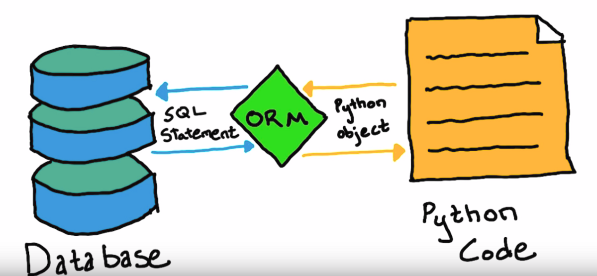

Intro to Flask-SQLAlchemy
================================

While you can develop your own database using SQL, interacting with the database 
from a separate application requires a lot of work. You need to write a lot of code to
connect to the database, execute SQL commands, and handle the results. Because of this
there are many libraries and frameworks that help you interact with databases more easily.
Flask-SQLAlchemy is one of the most popular libraries for working with databases in python applications.
For the next module we will go over what it is, the basics of it's usage, and how you can 
use it for quick database setup and management.

After going through this module students should understand:

* What is SQLAlchemy?
* What is ORM?
* What is Flask-SQLAlchemy?
* Installing Flask-SQLAlchemy
* Basic commands in Flask-SQLAlchemy

ORM's
------------

Instead of needing to write SQL commands to interact with a database,
there are many libraries and frameworks available for high-level interfaces
to interact with databases. These can depend on different requirements such as
the database you are using, the programming language you are using, 
and the type of application you are building.

These types of libraries and frameworks are known as **Object Relational Mappers (ORM)**.
ORMs allow you to interact with a database using high-level programming constructs,
such as classes and objects, instead of writing raw SQL queries. This makes it easier to work with databases, 
especially for developers who are more familiar with programming languages than SQL. 
ORMs also help in abstracting database-specific details, making your code more portable across different database systems.

SQLAlchemy
~~~~~~~~~~

.. note::

    This section is intended for viewing only, as we will see how we can use 
    Flask-SQLAlchemy to make database development easier than using pure SQLAlchemy.

`SQLAlchemy <https://www.sqlalchemy.org/>`_ is a popular ORM for working with databases in Python. 
It provides a high-level interface for interacting with databases, 
allowing you to write Python code instead of SQL commands. 
It supports multiple database backends, including SQLite, PostgreSQL, MySQL, and others.

The installation process is similar to anything python package.

.. code-block:: bash

    pip install SQLAlchemy

Instead of writing SQL commands, you can define your database schema using Python classes.
Take a look at the example below taken from the SQLAlchemy quickstart guide.

.. code-block:: python
    :linenos:

    from typing import List
    from typing import Optional
    from sqlalchemy import ForeignKey
    from sqlalchemy import String
    from sqlalchemy.orm import DeclarativeBase
    from sqlalchemy.orm import Mapped
    from sqlalchemy.orm import mapped_column
    from sqlalchemy.orm import relationship

    class Base(DeclarativeBase):
        pass

    class User(Base):
        __tablename__ = "user_account"
        id: Mapped[int] = mapped_column(primary_key=True)
        name: Mapped[str] = mapped_column(String(30))
        fullname: Mapped[Optional[str]]
        addresses: Mapped[List["Address"]] = relationship(
            back_populates="user", cascade="all, delete-orphan"
        )
        def __repr__(self) -> str:
            return f"User(id={self.id!r}, name={self.name!r}, fullname={self.fullname!r})"

    class Address(Base):
        __tablename__ = "address"
        id: Mapped[int] = mapped_column(primary_key=True)
        email_address: Mapped[str]
        user_id: Mapped[int] = mapped_column(ForeignKey("user_account.id"))
        user: Mapped["User"] = relationship(back_populates="addresses")
        def __repr__(self) -> str:
            return f"Address(id={self.id!r}, email_address={self.email_address!r})"

The previous code is using a technique known as **Declarative Mapping**.
This allows you to define your database schema using Python classes,
and SQLAlchemy will automatically generate the necessary SQL commands to create the database tables.

So if you were to run this code, SQLAlchemy would create the following tables:

.. code-block:: sql

    CREATE TABLE user_account (
        id INTEGER NOT NULL, 
        name VARCHAR(30), 
        fullname VARCHAR, 
        PRIMARY KEY (id)
    );
    CREATE TABLE address (
        id INTEGER NOT NULL, 
        email_address VARCHAR, 
        user_id INTEGER, 
        PRIMARY KEY (id), 
        FOREIGN KEY(user_id) REFERENCES user_account (id)
    );

This is a fairly complex example, that shows how you can define your database schema using 
Python classes and SQLAlchemy will take care of the rest. There are a couple of thing that 
Flask-SQLAlchemy handles under the hood to make this easier. We will still use some 
SQLAlchemy syntax though , as Flask-SQLAlchemy is built on top of SQLAlchemy. 

Flask-SQLAlchemy
----------------

`Flask-SQLAlchemy <https://flask-sqlalchemy.readthedocs.io/en/stable/>`_ is an extension for Flask that adds support for **SQLAlchemy**.
It's also an **ORM** but simplifies the process of working with databases in 
Flask applications. Over the next few sections we will go over how to install Flask-SQLAlchemy,
how to use it, and some of the basic commands you can use to interact with a database. We will
build a simple Flask app that interacts with movie data, similar to what you have been 
using for your assignments.

Setup
~~~~~

1. Create a new directory for your project and navigate to it.
2. Create a new virtual environment using the following command:

   .. code-block:: bash

        python3 -m venv movies

3. Activate the virtual environment using the following command:
    
   .. code-block:: bash
    
    source movies/bin/activate # for Linux/MacOS
    
    movies\Scripts\activate # for Windows

4. Install Flask and Flask-SQLAlchemy

   .. code-block:: bash

    pip install Flask Flask-SQLAlchemy psycopg2

   For the following examples we will use `PostgreSQL <https://www.postgresql.org/>`_ as our database.
   Postgres is the standard library that most organizations use for their databases.
   You can use any database you want, but for the instructions we will use Postgres.

.. note::

    In the previous instructions we installed a new python package called **psycopg2**.
    This is an adapter for Python applications to connect to PostgreSQL databases.
    It is how Flask-SQLAlchemy will connect to the database and perform the actions we want.

    For more information checkout the official documentation: `psycopg2 <https://www.psycopg.org/docs/>`_

5. We're going to create a volume if we don't have one, and start a postgres container 
   using docker like the previous lecture.

   .. code-block:: bash
    
    docker volume create pgdata
    docker run --name db -e POSTGRES_PASSWORD=secret -v pgdata:/var/lib/postgresql/data -p 5433:5432 -d postgres:17.4

   The one extra parameter this has than the previous lecture is the **-p 5433:5432**.
   This is the port mapping for the postgres container.
   The first number is the port on your local machine, and the second number is the port on the container.
   This means that you can access the postgres database on your local machine using port 5433.
   (port 5432 seems to have issues with some versions of docker, so we are using 5433 instead).

   .. danger::

    When working with ports sometimes Windows or Mac will cause issues with ports being used, but not saying
    explicitly if there is a problem. If you encounter an error like **"FATAL:  password authentication failed for user "postgres"**
    then try changing the port to something like `1234`.

#. We can then connect to our container and run the following command to create a new database:

   .. code-block:: bash

    docker exec -it db psql -U postgres

   This will open a new terminal window with the postgres command line interface.
   You can then run the following command to create a new database:

   .. code-block:: sql

    CREATE DATABASE movies;

   We can verify that the database was created by running the following command:

   .. code-block:: sql

    \l

This will list all the databases in the postgres server.
You should see a database called **movies** in the list.

We can then exit the postgres command line interface by running the following command:

We are now ready to start building our Flask application and create tables.

Connection and Model
---------------------

Connection 
~~~~~~~~~~

Now that we have our database setup, we can start building our Flask application.
Flask-SQLAlchemy provides a simple way to define your database models using Python classes.
In general it's a good idea to separate the models and configuration for your database.
That way you do not have reuse the same code in multiple places, and it makes it 
easier to maintain your codebase.

We'll create a new file in the main directory of our Flask application called **app.py**.

Your directory structure should look like this after following the above steps:

.. code-block:: bash

    ├── app.py
    └── movies

Configuration
^^^^^^^^^^^^^

We will first configure our Flask application and the database connection.
Let's add this following code to our **app.py** file.

.. code-block:: python
    :linenos:

    from flask import Flask
    from flask_sqlalchemy import SQLAlchemy

    DB_NAME = 'movies'
    DB_PASSWORD = 'secret'
    DB_USERNAME = 'postgres'
    DB_HOST = 'localhost'
    DB_PORT = '5433'

    app = Flask(__name__)

    app.config['SQLALCHEMY_DATABASE_URI'] = f'postgresql://{DB_USERNAME}:{DB_PASSWORD}@{DB_HOST}:{DB_PORT}/{DB_NAME}'

    db = SQLAlchemy(app)

Here we are doing a couple of things to setup our database connection from Flask.

#. We are importing the necessary modules from Flask and Flask-SQLAlchemy.
#. lines 4 - 8 are defining database connection parameters. Flask-SQLAlchemy
   uses these parameters to construct a connection string to connect to the database.
#. line 10 is where we are creating a new Flask application instance. 
#. Line 12 is where we are setting the **SQLALCHEMY_DATABASE_URI** configuration variable. 
   This is the connection string that Flask-SQLAlchemy will use to connect to our PostgreSQL database.
#. Line 13 is where we are disabling the **SQLALCHEMY_TRACK_MODIFICATIONS**.
   This is a feature that Flask-SQLAlchemy provides to track modifications of objects and emit signals. 
   Disabling this will save memory and improve performance, as we won't be using this feature in our simple example.
#. Line 15 is where we are creating an instance of **SQLAlchemy** and passing in our Flask application instance. 
   This will allow us to use the SQLAlchemy object in our models to interact with the database.

.. note::

    The **SQLALCHEMY_DATABASE_URI** is a standard format for connection strings in SQLAlchemy.
    PostgreSQL uses the following format for the connection string:

    .. code-block:: text

     postgresql://<username>:<password>@<host>:<port>/<database_name>

    MySQL uses a similar format:

    .. code-block:: text

     mysql://<username>:<password>@<host>:<port>/<database_name>

    Lastly, SQLite uses a different format as it stores everything in a single file on disk
    and requires you to use the os module to specify the correct path:

    .. code-block:: text

     import os
     basedir = os.path.abspath(os.path.dirname(__file__))
     app.config['SQLALCHEMY_DATABASE_URI'] = 'sqlite:///' + os.path.join(basedir, 'database.db')

Models
^^^^^^

Now that we have a way to connect to the database, we can define our 
first database model. flask-SQLAlchemy allows us to define our database models 
using Python classes. You can define attributes on the class to represent the 
columns in the database table. Most models will usually inherit from the ``db.Model`` 
class, along with other attributes to define the table name, columns, and relationships.

Add the following code to your app.py file in the correct locations (imports at top, Classes at bottom).

.. code-block:: python

    from sqlalchemy.orm import mapped_column

    # Movies Model
    class Movie(db.Model):

        id        = mapped_column(db.Integer, primary_key=True)
        title     = mapped_column(db.String(80), nullable=False)
        year      = mapped_column(db.Integer, nullable=False)
        directors = mapped_column(db.ARRAY(db.String), nullable=False)
        theatre   = mapped_column(db.Boolean, default=True)

        def __repr__(self):
            return f'<Movie {self.title}>'

.. note::

    Postgres allows us to use the **ARRAY** type for columns, 
    which allows us to store an array of values in a single column.
    Other databases like MySQL or SQLite do not support this type natively,
    and you would need to use a different approach to store arrays or lists in those databases.

Here we have defined a **Movie** model which extends the ``db.Model`` class. 
The left side of the assignment represents the column name in the database,
while the right side represents the column type and attributes.

There are a couple of things to note about defining columns:

* We use ``mapped_column`` to define a column in the database table.
* The first argument is the column type, such as ``db.Integer``, ``db.String``, etc.
* We can also specify additional attributes such as ``primary_key``, ``nullable``, and ``default`` to control the behavior of the column.
* The ``__repr__`` method is used to provide a string representation of the object. 
  This is useful for debugging and logging purposes. In this case, it will return the title of the movie when we print the object.

Table Creation
--------------

Flask Shell
~~~~~~~~~~~

Let's look at how we can use the flask shell to create the tables in our database. 
Through the terminal you have been working with, make sure that your virtual environment
is running. Then, run the following command to start the Flask shell:

.. code-block:: bash
    :linenos:

    export FLASK_APP=app
    flask shell

The first line is setting the **FLASK_APP** environment variable to the name of 
our Flask application, which in this case is **app.py**. The next line starts
the flask shell, which is an interactive Python shell that has access to
the database.

Once you are in the shell, you can run the following commands to create the table in your database:

.. code-block:: python

    from app import db, Movie
    db.create_all()

``db.create_all()`` is a provided method by Flask-SQLAlchemy that creates all the tables in the database
based on the models you have defined.
This will create the **movies** table in the database with the columns we defined in the **Movie** model.

.. important::

    ``db.create_all()`` doesn't recreate or update a table if it already exists.
    Meaning if you modify your table structure, you will need to drop the 
    table and recreate it. You can drop it using ``db.drop_all()`` and then run 
    ``db.create_all()`` again.

Now that we have our table created, we can start inserting data into the database.
Let's create a new ``Movie`` from the shell and add it to the database.

.. code-block:: python
    :linenos:

    # Create a new movie
    new_movie = Movie(title='The Matrix', year=1999, directors=['Lana Wachowski', 'Lilly Wachowski'], theatre=True)

    # Add the movie to the session
    db.session.add(new_movie)

    # Commit the session to save the changes to the database
    db.session.commit()

The code here creates a new **Movie** object and adds it to the database session.
The **db.session.add()** method adds the new movie to the session, 
and the **db.session.commit()** method commits the changes to the database.

Most queries follow this structure where you create a new object, 
add it to a session and commit the changes to the database.

You can also query all the movies in the database using the following command:

.. code-block:: python

    >>> from sqlalchemy import select
    >>> results = db.session.scalars(select(Movie)).all()
    >>> results
    [<Movie The Matrix>, <Movie Inception>, <Movie Interstellar>, <Movie The Dark Knight>]

The next module will go over what these queries do, but for now just know that
they execute the SQL commands and return the results for you.

Give it a try and see if you see the movie you just added in the output.

Exercise 1
~~~~~~~~~~

Now that you have created your first movie, let's try adding a few more movies to the database.

* create 3 new movies in the database.
* Make sure to include different directors and years for each movie.
* After adding the movies, query the database again to see all the movies you have added.

Python Scripts
~~~~~~~~~~~~~~~~

While the flask shell is good for testing and quick interactions,
it's not the best way to manage your database in a production environment.
Instead, you can create Python scripts to manage your database operations.
This allows you to automate tasks such as adding, updating, or deleting records in the database.

Let's create a new file called **populate.py** in the main directory of our Flask application.

Instead of running the Flask shell every time, we can use this script to create starting data in our database.

.. code-block:: python
    :linenos:

    from app import db, app, Movie

    def create_movie(title, year, directors, theatre=True):

        new_movie = Movie(title=title, year=year, directors=directors, theatre=theatre)
        db.session.add(new_movie)
        db.session.commit()
        print(f"Movie '{title}' added to the database.")

    if __name__ == '__main__':

        with app.app_context():
    
            create_movie('Inception', 2010, ['Christopher Nolan'], True)
            create_movie('Interstellar', 2014, ['Christopher Nolan'], True)
            create_movie('The Dark Knight', 2008, ['Christopher Nolan'], True)

Here we have defined a function called **create_movie** that takes the 
title, year, directors, and theatre status as parameters.
This function creates a new **Movie** object, adds it to the database session,
and commits the changes to the database.

Line 13 might look unfamilar. It is using the **app.app_context()** context manager.
This sets up and makes sure that you can connect to the database and perform
different operations on it. It is usually required for runnnig scripts 
This is especially important when running scripts outside of the Flask shell.

You can learn more about flask application context here: 
https://flask-sqlalchemy.readthedocs.io/en/stable/contexts/.

If you want you can comment out line 13 and run the script without the application context,
and see the error you get.

To run this script, make sure your virtual environment is activated and run the following command:

.. code-block:: bash

    python populate.py

You should hopefully see an output that looks something like this

.. code-block:: text

    Movie 'Inception' added to the database.
    Movie 'Interstellar' added to the database.
    Movie 'The Dark Knight' added to the database.

Now open up a new flask shell and see if you can query to see your new movies.

.. code-block:: bash

    flask shell

.. code-block:: python

    >>> from app import db, Movie
    >>> from sqlalchemy import select
    >>> results = db.session.scalars(select(Movie)).all()
    >>> results

You should see a list of all the movies you have added to the database, 
including the ones you just created using the script.

.. tip::

    As you can tell just adding python scripts into the root folder can start to make the folder grow and become
    confusing on what files do which. It would be better to separate any scripts into their own folder so that it is
    clear that they are for separate uses.

Exercise 2
~~~~~~~~~~

Now that you have learned how to create movies using a script, 
let's add a few more to the list.

.. note::

    If you add the same movie again, it will create a duplicate entry in the database.
    You can comment out the lines in the **populate.py** script that create the movies.

* Modify the **populate.py** script to add 3 more movies of your choice.
* Make sure to include different directors and years for each movie.
* Run the script again to add the new movies to the database.
* After running the script, open the Flask shell and query the database again to see all the movies you have added.

Migrations
----------

As you build your application, the schema of your database models are bound to change. You may need to add a new
column to store more information, add a foreign key, or delete a column no longer necessary. You could manually
update your database, but this can be tedious and prone to errors. In a team this can be even more problematic
with one central user only able to update things at a time.

**Database Migrations** manage these changes to your database schema by writing code to solve these issues.
`Flask-Migrate <https://flask-migrate.readthedocs.io/en/latest/>`_ is a Flask extensions built to handle SQLAlchemy
database migrations. It is a wrapper for another database tool `Alembic <https://alembic.sqlalchemy.org/en/latest/>`_
that allows you to update your schema more easily.

Set-Up
~~~~~~

We first need to install Flask-Migrate using `pip`.

.. code-block:: bash

    pip install Flask-Migrate

Let's add the following code to our **app.py** file.

.. code-block:: python
    :linenos:
    :emphasize-lines: 3, 18

    from flask import Flask, jsonify, render_template, request, redirect, url_for
    from flask_sqlalchemy import SQLAlchemy
    from flask_migrate import Migrate

    from sqlalchemy.orm import mapped_column

    DB_NAME = 'movies'
    DB_PASSWORD = 'secret'
    DB_USERNAME = 'postgres'
    DB_HOST = 'localhost'
    DB_PORT = '1234'

    app = Flask(__name__)

    app.config['SQLALCHEMY_DATABASE_URI'] = f'postgresql://{DB_USERNAME}:{DB_PASSWORD}@{DB_HOST}:{DB_PORT}/{DB_NAME}'

    db = SQLAlchemy(app)
    migrate = Migrate(app, db)

Adding lines **3** and **18** to our code sets up the Migration package for us to use in our application.

Initial Migration
~~~~~~~~~~~~~~~~~

With Flask-Migrate now ready, the first step is to setup a migration repository. This is a directory that will store
all the migration scripts that are generated. These scripts are used to update the database schema automatically for us
instead of us having to create these on our own.

Run the following command:

.. code-block:: bash

    flask db init

You should now see a ``migrations`` folder in your project. There is a ``versions`` directory and a configuration file
`alembic.ini` which is used to setup **Alembic** automatically for us.

Our next step is to generate the first migration of our database schema. This will capture the initial state of
our database models and create a script for generating the corresponding schema.

.. code-block:: bash

    flask db migrate -m "Initial migration."

Just like **git**, we use use complementary commands to store our reasons for updating our database schema. The\
previous command creates a new file inside the ``migrations/versions`` directory, which is the code needed to
create our tables.

We can apply migrations and create tables in our database by running the following command:

.. code-block:: bash

    flask db upgrade

.. attention::

    While most changes to our schema's are updated, it is always important to check the generated scripts inside
    ``migrations/versions`` to make sure the changes in the script match the changes we intend to make on our models.

    Any migration scripts we create should also be committed to our version control system, like git. This keeps a
    history of our schema and ensure the entire team have the same scripts. If anyone needs to update their schema
    locally, then can run the ``upgrade`` command once they have the most recent migration script(s).

Movie Changes
~~~~~~~~~~~~~

Now that are migrations are setup, we can make changes to our models and persist those changes in our database.
Say we wanted to add an **MPA** column to our *Movie* Model. We would first update our model in our ``app.py`` file:

.. code-block:: python
    :linenos:

    # Movies Model
    class Movie(db.Model):

        id        = mapped_column(db.Integer, primary_key=True)
        title     = mapped_column(db.String(80), nullable=False)
        year      = mapped_column(db.Integer, nullable=False)
        directors = mapped_column(db.ARRAY(db.String), nullable=False)
        theatre   = mapped_column(db.Boolean, default=True)
        mpa       = mapped_column(db.String(5), nullable=True)

        def __repr__(self):
            return f'<Movie {self.title}>'

After updating our model we then run the ``migrate`` command to generate our migration script:

.. code-block:: bash

    flask db migrate -m "Add mpa column to Movie model."

Now that our migration script is generated, we can run the `upgrade` command to apply our changes to our database.

.. code-block:: bash

    flask db upgrade

Exercise 1
~~~~~~~~~~

Try adding a few more columns to our model and see if you can keep track of applying changes. Take a look at the database
when these changes happen. What do you see inside the database? What happens if you delete a column instead of adding
one to your model?

Additional Resources
---------------------

Materials in this module were based on the following resources

* `Digital Ocean Tutorial <https://www.digitalocean.com/community/tutorials/how-to-use-flask-sqlalchemy-to-interact-with-databases-in-a-flask-application>`_
* `Flask-SQLAlchemy <https://flask-sqlalchemy.readthedocs.io/en/stable/>`_

----------

* `SQLAlchemy Query Guide <https://docs.sqlalchemy.org/en/20/orm/queryguide/>`_