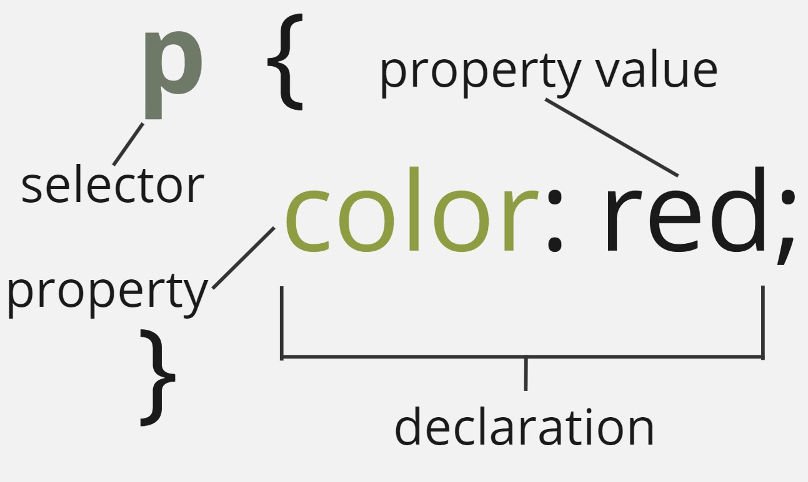

.. role:: red

Introduction to CSS
=====================

In this section, we will explore CSS and how it helps with designing a website.
this includes problems such as coloring (text/background), making the content display at a certain location,
and "decorating" with images and color schemes. After this module, you should understand:

:red:`list of what they will learn.`

Setup and Installation
----------------------

You should still have your old directory from the previous module that covered HTML with the associated **index.html** file.
Navigate to your directory. You can use the ``index.html`` you created last time for Exercise 2 of the HTML, or
copy an update version that is done `here <https://raw.githubusercontent.com/andrewsolis/cs401/refs/heads/main/docs/unit08/resources/index_css.html>`_.

Run the following command to setup your small webserver, and navigate to http://localhost:8000/ to verify it is up and running.

.. code-block:: console

    [terminal]$ cd newsite
    [terminal]$ python -m http.server

What is CSS?
------------

CSS, or Cascading Style Sheets, are similar to HTML, in that it is not a programming language.
However, it is also not a markup language. It is rather a **style sheet language**. It is used
to style HTML elements. For example, say we wanted to make all ``p`` tags red.

.. code-block:: css
    :linenos:

    p {
        color: red;
    }

But where exactly do we put this? Notice how you created a folder in the previous material on HTML called ``styles``. 
Open it up and place a new file called **style.css**. Then, paste the following line inside your **index.html** file within
the ``<head>`` tag.

.. code-block:: HTML
    :linenos:

    <link href="styles/style.css" rel="stylesheet" />

All of your paragraph tags should now be red. Be sure to reload the page if needed.

Let's take a closer look at how CSS is used.

Anatomy of CSS
~~~~~~~~~~~~~~

    CSS Anatomy

From the image above we can see a breakdown of a CSS **ruleset**. Let's analyze the individual parts.

- **selector** - The html element type to be styled. 
- **Declaration** - Our single rule is to change the color of the text to red. We have a single declaration here, but there can be multiple for a CSS ruleset.
- **Property** - Which property we like to change or apply to our selector.
- **Property Value** - the value of the property we wish to set.

Instead of just setting the color, let's try setting a few more properties.

.. code-block:: css
    :linenos:

    p {
        color: red;
        background-color:rgb(55, 43, 226);
        height: 100px;
    }

.. note::

    color attributes can be set by many basic colors by name, rgb, hsl, and hex. To learn more about colors click here:  `CSS Colors <https://www.w3schools.com/css/css_colors.asp>`_.

Say instead of just selecting all the ``p`` elements we wanted to select other elements on our page and change their color.

.. code-block:: css
    :linenos:

    p,
    li,
    h3 {
        color: red;
    }

.. warning::

    Try to make sure that certain rules are set for a particular element and not set also in other places. This can create conflicts where you deal with heirarchy of which rules to apply, which
    is normal but can be a pain when starting to learn about CSS.

Types of Selectors
~~~~~~~~~~~~~~~~~~

Up to this point we have only been applying our rulset to HTML elements. However, they are other selectors that are available through CSS that can help make our selections more specific.

Element
^^^^^^^

**Element** selectors select all elements of a given type. We have seen these before when we specified we wanted to apply something to all ``p`` elements.

Example

.. code-block:: css
    :linenos:
    :emphasize-lines: 1,5

    p{
        color: red;
    }

    h1, h2, h3 {
        font-size: 200%
    }

Class
^^^^^

**Class** selector is one of the most common selectors used in CSS. Elements on the page are given a name for the ``class`` attribute of an html element.
Multiple classes can be applied to a single html element, by simply spacing out the class names.
Say we wanted all our titles to have a class, and use a class to change the text color.

.. code-block:: html
    :linenos:
    :emphasize-lines: 2, 7, 10

    <header>
        <h1 class="title gr">Planet Express!</h1>
        ...
    </header>
    ...
    <main>
        <h2 class="title or">Main Content</h2>
        ...
        <aside>
            <h3 class="title bl">Related content</h3>
            ...
        </aside>
    </main>
    <footer>
        
Copyright Planet Express 2024

    </footer>

We then specify a class in our ``style.css`` file using a period (**.**) in the selector place.

.. code-block:: css
    :linenos:

    .title {
        font-style: italic;
    }

    .gr {
        color: green;
    }

    .or {
        color: orange;
    }

    .bl {
        color: blue;
    }

Try changing the color of all of your headlines to different colors using ``classes``.

ID
^^

The ``ID`` selector is used similar to class where it can be applied to an HTML tag using the ``id`` attribute.
However, the similarities stop there, as there are some key differences.

1. The attribute is specified in a css file using the number or hash sign (**#**).
2. An ID is expected to only be placed on a **SINGLE** html element. This is different from classes which can be placed across multiple elements.
3. ID takes a precedence over class, meaning if you define a property in both an ID and Class specification, the ID will be used.

.. code-block:: html
    :linenos:
    :caption: index.html

    <header>
            <h1 id="main_title" class="title gr">Planet Express!</h1>
            
    </header>

.. code-block:: css
    :linenos:
    :caption: style.css

    
    #main_title {
        color: rgb(121, 0, 0);
    }

.. warning::

   Most code editors usually do not if an ID is only placed on a single element. 
   This is more of a design pattern that is expected to be followed. 
   With that in mind please be mindful of not accidentally using ID's in multiple places.

Class and id selectors can be combined with element selectors to give even more specificity.

.. code-block:: css
    :linenos:
    :caption: style.css

    h1#main_title {
        font-style: italic;
    }
    
    h2.title {
        color: rgb(121, 0, 0);
    }

Attribute Selectors
^^^^^^^^^^^^^^^^^^^

These selectors are used with element selectors to specify an element based on an attribute that it has. 
This can be used to apply for elements that just have an attribute, or the attribute is set to a specific example.

.. code-block:: css
    :linenos:
    
    /* change all links with href attribute to black */
    a[href] {
        color: black;
    }

Pseudo-class Selector
^^^^^^^^^^^^^^^^^^^^^

These **pseudo-class** selectors are named so because they are styles given to signify a state of an element. 
You can think of different styles that change as you explore a website such hovering over an element, the first line of an element, and more.

.. code-block:: css
    :linenos:
    
    /* link color when hovered over */
    a:hover {
        color: black;
    }

For a full list of all selectors, click here: `CSS Selectors <https://developer.mozilla.org/en-US/docs/Web/CSS/CSS_selectors>`_.

Exercise 1
~~~~~~~~~~

Remove all CSS in your current ``style.css`` file.
Apply the following changes to your ``index.html`` file.

Apply the follwing styles in your stylesheet file. Be sure to set your attributes as needed in your ``index.html`` file.

- Give each header a different `color <https://www.w3schools.com/cssref/pr_text_color.php>`_ using a **class** selector
- Give each header the **same** `font-family <https://developer.mozilla.org/en-US/docs/Web/CSS/font-family>`_ using a **class** selector
- Set the **font-family** for the footer paragraph with the copyright using an **id** selector
- set the color of all links in the ``nav`` HTML element using **any** selector
- set the color of all links in the ``aside`` only on **hover** using the `hover <https://www.w3schools.com/cssref/sel_hover.php>`_ psuedo selector

Remember that google and even AI are your friend (just not skynet)

Using CSS
---------

Combinators
-----------

Specificity and Inheritance
---------------------------

The Box model
-------------

Flexbox
-------

Additional Resources
--------------------
* Some of this materials is based on Mozilla `Learn Web Development <https://developer.mozilla.org/en-US/docs/Learn>`_
* `W3 Schools CSS <https://www.w3schools.com/css/css_intro.asp>`_
* `CSS Flexbox Layout Guide <https://css-tricks.com/snippets/css/a-guide-to-flexbox/>`_
* `CSS Guidelines Blog <https://cssguidelin.es/>`_