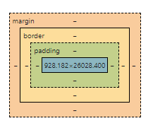

.. role:: red

Introduction to CSS: Part 2
===========================

In this section, we will explore more CSS concepts related to the layout of a page. 
We will look at how specificity and inheritance work in CSS, and how to use them to style your page.
We will look at the box model, and how it can be used to layout your page. 
We will also look at Flexbox, a layout model that is part of CSS3, and how it can be used to create flexible layouts. 
Finally, we will look at responsive design, and how to create a page that looks good on all devices.
After this module, students should be able to:

:red:`what students will learn`

Setup and Installation
----------------------

You should still have your old directory from the previous module that covered HTML with the associated **index.html** file.
Navigate to your directory. You can use the ``index.html`` you created last time for Exercise 2 of the HTML, or
copy an update version that is done `here <https://raw.githubusercontent.com/andrewsolis/cs401/refs/heads/main/docs/unit08/resources/index_css.html>`_.
 

Run the following command to setup your small webserver, and navigate to http://localhost:8000/ to verify it is up and running.

.. code-block:: console

    [terminal]$ cd newsite
    [terminal]$ python -m http.server

Specificity and Inheritance
---------------------------

Specificity
~~~~~~~~~~~

At a certain time when you are styling a page, you will notice that some styles are not being applied as you expect.
This is because of the way CSS handles specificity and inheritance.

Specificity is the way CSS determines which style to apply to an element when there are multiple styles that could apply.
The more specific a style is, the more likely it is to be applied.
The specificity of a style is determined by the number of selectors in the style, and the type of selectors used.
For example, a style with an ID selector is more specific than a style with a class selector, which is more specific than a style with an element selector.
If two styles have the same specificity, the one that comes later in the CSS file will be applied.

.. code-block:: css
    :linenos:

    h1 {
        color: red;
    }

    h1 {
        color: blue;
    }

Say we have two separate selectors: one using an element selector and the other using a class selector.

.. code-block:: css
    :linenos:

    h1 {
        color: red;
    }

    .heading {
        color: blue;
    }

The style with the class selector will be applied, because it is more specific than the style with the element selector.
This is the case even if the ``h1`` selector appears further down in the CSS file.

| The amount of specificity a selector has is measured on a three column value of three categories, or weights: ID, CLASS and TYPE.
| This is usually represented as notation as ``(A, B, C)``
| A number to the left has a higher weight than a number to the right.

For example:

* The selector ``h1`` has a specificity of ``(0,0,1)``, because it has one TYPE selector.
* The selector ``.heading`` has a specificity value ``(0,1,0)`` because it has one CLASS selector.
* The selector ``#main`` has a specificity value of ``(1,0,0)``, because it has one ID selector.
* The selector ``h1.heading`` has a specificity value of ``(0,1,1)``, because it has one TYPE selector and one CLASS selector.
* The selector ``h1#main`` has a specificity value of ``(1,0,1)``, because it has one TYPE selector and one ID selector.
* The selector ``h1.heading#main`` has a specificity value of ``(1,1,1)``, because it has one TYPE selector, one CLASS selector, and one ID selector.

You can learn more about specificity here: https://developer.mozilla.org/en-US/docs/Web/CSS/Specificity.

Inheritance
~~~~~~~~~~~

Inheritance is the way CSS determines which styles are applied to an element based on the styles of its parent elements.
Some CSS property values are inherited from a parent by it's childresn, and some aren't.
For example, the ``color`` property is inherited, so if you set the color of a parent element, the color of its children will be the same.

.. code-block:: css
    :linenos:

    body {
        color: red;
    }

    p {
        color: black;
    }

There are some properties that are not which include width, margin, padding, and border. 

CSS provides five special property values that can be used to control inheritance:

* ``inherit``: The property value is inherited from the parent element.
* ``initial``: The property value is set to the default value for the property.
* ``revert``: The property value is set to the default value for the property, unless the property is naturally inherited, in which case it acts like ``inherit``.
* ``revert-layer``: Resets the property value applied to a selected element to the value extablished in a previous cascade layer.
* ``unset``  : Resets the property to its natural value, which means that if the property is naturally inherited it acts like ``inherit`` and if it is not naturally inherited it acts like ``initial``.

You can learn more about these properties here: https://developer.mozilla.org/en-US/docs/Learn/CSS/Building_blocks/Cascade_and_inheritance.

The Box model
-------------

CSS layouts are mostly based on the box model. The box model is a way of representing elements on a page as boxes with content, padding, borders, and margins.

    CSS Box Model

You can define an elements ``display`` value which specifies how the element is laid out on the page.
Thee most common values are:

* ``block``: The element is displayed as a block, taking up the full width of the page.
* ``inline``: The element is displayed as an inline element, taking up only as much width as it needs.
* ``inline-block``: The element is displayed as an inline element, but can have padding and margins.
* ``flex``: The element is displayed as a flex container, allowing you to use the flexbox layout model.

For the ``flex`` layout we will cover later on what this exactly means and does.

Each box taking up space has the following properties:

* ``Content``: The actual content of the box, such as text or images.
* ``Padding``: The space between the content and the border.
* ``Border``: The border around the box.
* ``Margin``: The space between the border and other elements on the page.

For example, say we have a box with the following CSS:

.. code-block:: css
    :linenos:

    .box {
        width: 250px;
        height: 350px;
        margin: 10px;
        padding: 0px 20px 10px 20px;
        border: 10px solid black;
    }

Then we would have a box that would follow the following properties:

* The content of the box would be **250px** wide and **350px** tall.
* The margin would be **10px** on all sides.
* The padding would be **0px** on the top, **20px** on the right, **10px** on the bottom, and **20px** on the left.
* The border would be **10px** wide and **solid black**.

You can learn more about the box model here: https://developer.mozilla.org/en-US/docs/Learn/CSS/Building_blocks/The_box_model.

Flexbox
-------

Responsive Design
-----------------

Additional Resources
--------------------
* Some of this materials is based on Mozilla `Learn Web Development <https://developer.mozilla.org/en-US/docs/Learn>`_
* `Specificity <https://developer.mozilla.org/en-US/docs/Web/CSS/Specificity>`_
* `W3 Schools CSS Units <https://www.w3schools.com/cssref/css_units.php>`_
* `CSS Flexbox Layout Guide <https://css-tricks.com/snippets/css/a-guide-to-flexbox/>`_
* `CSS Guidelines Blog <https://cssguidelin.es/>`_